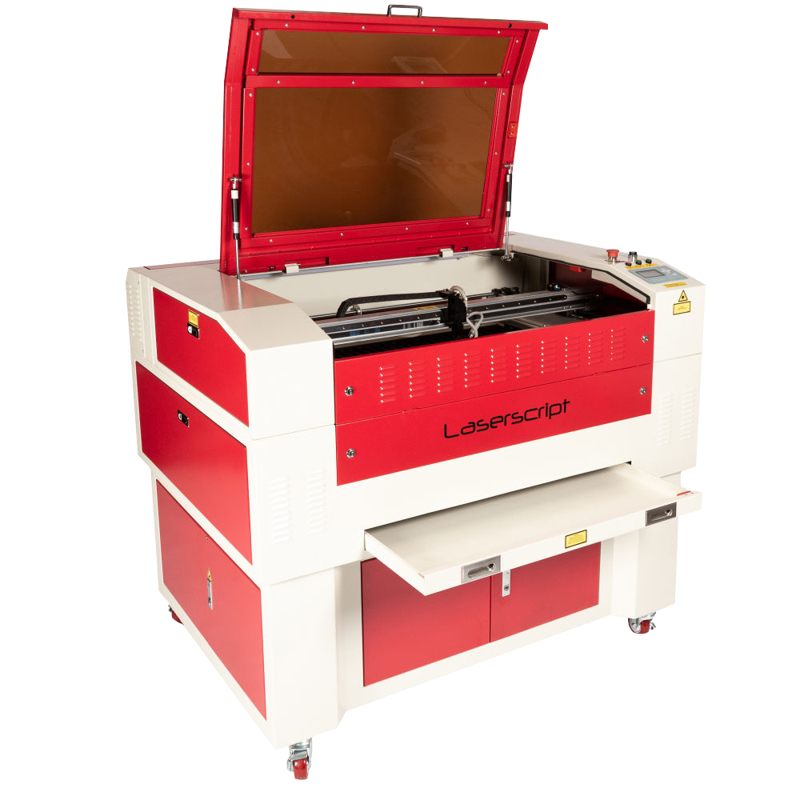

### Introduction to the LS6090 Laser Cutter

The LS6090 laser cutter is a powerful and precise tool, and its use is restricted to authorized personnel only. **Unauthorized usage is strictly prohibited**. 

If your name is not on [this list](https://docs.google.com/spreadsheets/d/1MFE98v1uAWj_X6pUiIf47AuMohh3w5HkenKLrgQjtzQ/edit?gid=0#gid=0), get inducted!

To operate the system, you must first be inducted by **Fabian Plum**. Please contact him at **f.plum@imperial.ac.uk** to arrange your induction.

For a full introduction to the system, please see the [**LS6090 SOP**](docs/SOP_LaserCutter_2024.pdf).

Additionally, ensure that you only use materials listed on the [**material settings sheet**](docs/material_settings_sheet.pdf) to avoid damaging the equipment or compromising safety.

